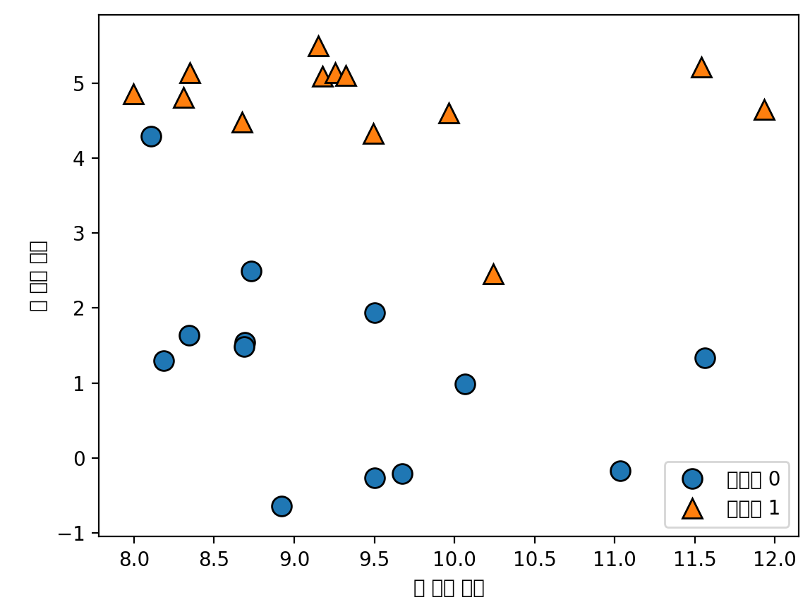

# K-NN(k-Nearest Neighbors)

## 학습(Training)
훈련 데이터셋을 그냥 저장하는 것이 학습

## 예측(Predict)
새로운 데이터의 분류는 훈련 데이터셋으로부터 가장 가까운 데이터의 레이블로 분류
K-NN 알고리즘에서 K의 의미는 가까운 이웃의 숫자를 의미

K=1 : 새로운 데이터가 들어왔을때 가장 가까운 한명의 이웃의 레이블로 분류된다는 의미
.png)
k>1 : K개 1보다 큰 경우, K개의 개수만큼의 가까운 이웃을 구한 후 그 이웃들의 레이블 중 가장 많은 레이블로 분류됨
.png)

## K-NN Regression
K-NN은 회귀 분석에도 사용되어짐
.png)